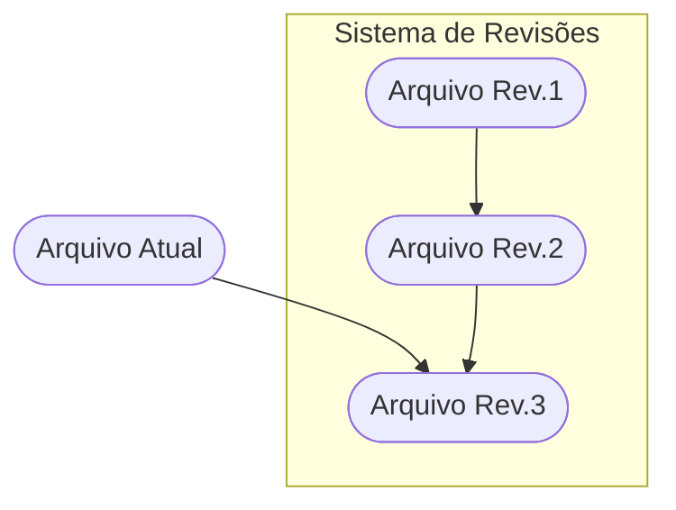
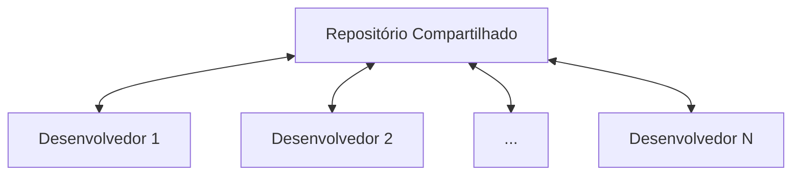
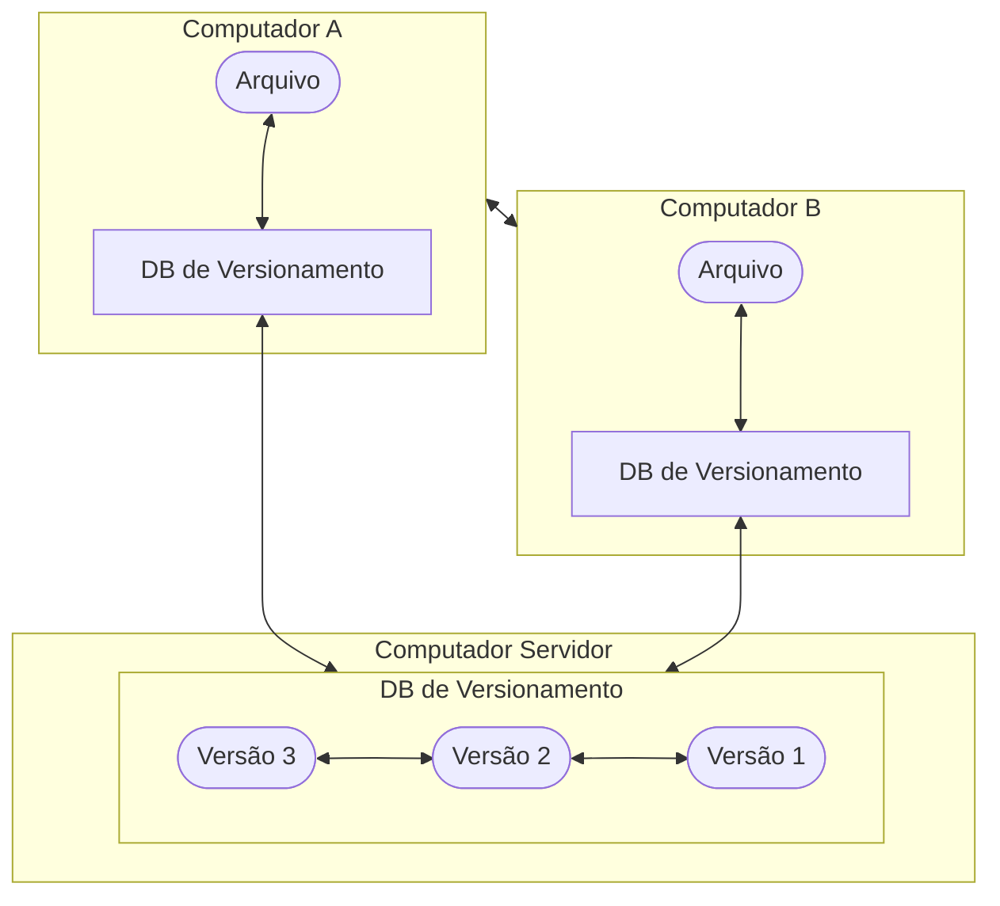

# Fichamento do livro "Pro Git" (2014) de Scoot Chacon e Ben Straub

## Introdução

Um breve resumo do que há no livro.
Capítulos:
1. Cobre sistemas de controle de versionamento (VCSs - Version Control Systems) e conceitos básicos (não técnicos) sobre o git;
2. Uso básico do Git - aplicação para 80% dos casos que encontraremos;
3. Conceito de ramificação (branching), diferencial da ferramenta;
4. Git no servidor. Implementação em servidores próprios para gerenciamento de projetos em uma organização;
5. A descrição de vários fluxos de trabalho distribuídos em como eles podem ser realizados com o Git;
6. Cobre o serviço de hospedagem GitHub, tal como suas ferramentas, em maior profundidade;
7. Comandos avançados do Git;
8. Customização de um ambiente Git;
9. Tratando o Git com outros VCSs (ex: Git e SVN);
10. Aprofunda conhecimentos do Git, sobre seu motor, como funciona, como ele empacota seus arquivos, protocolos do servidor; (Pode ser um bom caminho para começar o estudo, também).

O livro trata ainda de exemplos com diferentes interfaces gráficas e IDEs (Integrated Development Environment) - Apêndice A; Roteirização (Scripting) e extensão do Git através de ferramentas como libgit2 e JGit (ferramentas de baixo nível) - Apêndice B; E um resumo dos comandos mais utilizados no livro e seus resumos - Apêndice C.

## Sobre Controle de Versionamento

Controle de versionamento é um sistema que registra alterações a um arquivo ou grupo de arquivos no tempo, dessa forma, é possível manter um histórico dessas alterações e relembrar o que foi feito em uma determinada versão. Também é possível, dessa forma, reverter uma determinada alterações para um estado anterior (o exemplo do livro fala que isso é importante, por exemplo, para web designers que querem salvar versões específicas para determinados layouts, mas em geral, versionar é benéfico para praticamente qualquer projeto) com a ajuda do VCS.

### Sistemas de Controle de Versionamento Locais

Para algumas pessoas, a escolha inicial para versionamento é literalmente copiar arquivos de uma pasta para outra (Talvez uma pasta rastreada pelo tempo). A abordagem é comum pois é simples, porém, propensa a erros. Pois é fácil esquecer algum diretório ou acidentalmente copiar e sobrescrever o arquivo errado. Os VCSs sanam esse problema à medida em que possuem um banco de dados que mantém todas as alterações daquele contexto sob controle revisional (ou seja, é possível verificar o que foi alterado, antes mesmo de confirmar as alterações).

Dessa forma, aquele ou aqueles arquivos possuem versões desde sua criação que ficam armazenados em seu banco de dados. O autor menciona o "Revision Control System" (RCS), ferramenta popular para controle dessas revisões. O RCS trabalha mantendo uma lista das correções que cada arquivo recebeu (isto é, a diferença entre arquivos) num formato especial no disco. Dessa forma ele pode recriar qualquer arquivo da forma que ele era num determinado ponto do tempo, aplicando essas correções.

### Sistema de Controle de Versionamento Centralizado

O próximo passo, naturalmente é lidar com versionamento em escala, de forma colaborativa entre desenvolvedores de outros sistemas. Pala lidar com isso, existem os CVCSs (Centralized Version Control Systems), como o CVS, Subversion e Perfoce. A ideia é manter um servidor central que contém todos os arquivos versionados, de forma que um certo número de clientes acessem uma determinada quantidade de arquivos nesse "centro de distribuição". Segundo o autor, esse foi o padrão de controle de versionamento por muitos anos.

Essa abordagem é particularmente útil, pois é possível saber o que cada um está fazendo em um determinado momento. Dessa forma, administradores conseguem ter um controle granular sobre a produção de um projeto, pois é mais fácil administrar um CVCS do que lidar com as bases de alterações em cada cliente.

Contudo, há desvantagem, a mais notória é que todos os clientes dependem do servidor que provê o controle de versionamento. Se ele cai por uma hora, ninguém pode colaborar e consumir/salvar alterações versionadas. Isso vale pra quando o hardware em questão de redes, tanto quanto pra questão de disco, dado que uma vez que o disco se corrompe (e não há backup), todos os consumidores daquele sistema são afetados; ou quando há um problema não identificado no S.O. que hospeda o CVCS, se algum componente apresenta falha e assim por diante. Em suma, o problema da centralização é sempre o "centro". Se ele cai, todos caem.

### Sistema de Controle de Versionamento Distribuído

É onde entra o Distributed Version Control System (DVCSs). Nesses, como o Git, Mercurial ou Darcs, clientes não apenas consultam (fazem "checkout") arquivos ou seus "snapshots" (versões daquele arquivo), mas sim, do repositório inteiro (incluindo seu versionamento). Na prática, isso significa que se o "centro" morre, os pares continuam com a "fotografia" daquele respositório como um todo, em suas máquinas, o que pode ser restaurado posteriormente, na totalidade, em novos servidores.

Esse tipo de descentralização é importante, pois além do sistemas lidarem bem com múltiplos repositórios, os desenvolvedores podem trabalhar em multiplos projetos, simultaneamente, ou até mesmo, de maneira hierarquica.

### Uma breve história sobre o Git

O Kernel Linux, durante períodos de manutenção (1991-2002), teve suas mudanças de software registradas como correções (patches) e arquivamentos. Em 2002, o Kernel começou a usar um DVCS proprietário, chamado BitKeeper.

Em 2005 a relação entre a comunidade e a companhia comercial que devenvolveu o BitKeeper foi rompida, e a partir disso, o status de produto "sem encargos" foi revogado. Isso levou a comunidade de desenvolvimento Linux (e em particular, Linus Torvalds - seu criador) a desenvolver sua própria ferramenta partindo das lições aprendidas com o BitKeeper. Os objetivos dessa nova ferramenta foram: Velocidade; design simples; forte suporte ao desenvolvimento não linear (alto poder de desenvolvimento paralelo); completamente distribuído; capaz de lidar com grandes projetos tal como é o Kernel Linux, de forma eficiente (velocidade e volume de informação).

### O que é o Git?

O autor aponta aqui, que é importante se abster da forma como funcionam outros VCSs, pois a forma como Git funciona pode causar confusão na utilização da ferramenta.

#### Snapshots e não diferenças

A maior diferença entre o Git e outras VCSs está na forma como a informação é tratada. Conceitualmente, a maior parte dos sistemas armazena informação em uma lista baseada nas alterações dos arquivos. Esses sistemas pensam a informação armazenada como um conjuntos de arquivos e as alterações feitas neles durante o tempo (algo que é descrito como delta-based version control).

| Versão 1 | Versão 2 | Versão 3 | Versão 4 | Versão 5
| :--- | :---: | :---: | :---: | ---: |
| Arquivo A | Delta1 |  | Delta2 | |
| Arquivo B |  |  | Delta1 | Delta2 |
| Arquivo C | Delta1 | Delta2 | | Delta3 |

_(Alterando informação à medida em que a alteração ocorre em comparação com o arquivo base)_

O Git, em comparação, pensa sua informação mais como uma "série de fotografias" de um sistema de arquivos em miniatura. No Git, a cada submissão de código ao repositório (commit), o sistema basicamente armazena a informação de como estão todos seus arquivos no momento, e armazena essa referência no que é chamado de snapshot. Para isso ser eficiente, no entando, caso algum arquivo não tenha sido alterado, ele não o salvará novamente. Ele somente irá gerar um link simbólico desse arquivo (sem modificação) com o arquivo já salvo. Dessa forma, o Git pensa sua informação mais como um **fluxo de snapshots**.

| Versão 1 | Versão 2 | Versão 3 | Versão 4 | Versão 5
| :--- | :---: | :---: | :---: | ---: |
| Arquivo A | A1 | Ref (A1) | A2 | Ref (A2) |
| Arquivo B | Ref (B) | Ref (B) | B1 | B2 |
| Arquivo C | C1 | C2 | Ref (C2) | C3 |

_(Armazenamento dos snapshots ao longo do tempo)_

Essa é uma importante distinção entre o Git e **praticamente qualquer outro VCS**. Isso o torna praticamente como um mini sistema de arquivos com poderosas ferramentas funcionando sobre ele.

#### Praticamente toda operação é local

A maior parte das operações do Git precisam apenas do sistema de arquivos local para funcionar. Em geral, nenhuma outra informação externa (outro computador da rede, por exemplo) é necessária para isso. Se você estiver usando um CVCS, em contrapartida, notará que a maior parte das operação possuem um "atraso de rede" (sobrecarga de latência). Esse aspecto torna o Git, talvez o mais rápido e eficiente dos VCSs, pois toda história do repositório é acessada localmente.

Caso um usuário queira saber o estado em que o uma parte do projeto estava ou sua totalidade no tempo, basta que o mesmo resgate a informação através do Git, que calculará esse diferencial internamente. O Git não perguntará ao servidor remoto se isso é permitido (no caso de seu uso local). Isso demonstra ainda, seu enorme potencial offline de funcionamento, dado que, são poucas as coisas que não se pode fazer localmente. É como se o repositório local fosse sua carteira do histórico do projeto, e seu uso online, uma atualização (sincronização) desta com o servidor remoto (só aí então, guardadas os devidos requisitos daquele repositório, quando houverem).

#### O Git possui integridade

Toda informação no git passa por um checksum (verificação por somas baseada em um conjunto de informações) antes de ser armazenado, dessa forma, seu conteúdo é referenciado por essa hash. Isso torna impossível a alteração de qualquer informação no repositório, sem que isso fique registrado em algum lugar no Git. Esse é recurso é basilar no desenvolvimento do Git. O baixo nível de sua implementação tem como objetivo garantir a integridade e confiabilidade dos dados de seus repositórios (para além de ser sua filosofia). Não há corrupção de dado que não seja identificada pelo sistema.

O "checksumming" utiliza uma hash chamada SHA-1. Um texto de 40 caracteres composto por caracteres hexadecimais (0-9 e a-f) e calculado com base nos conteúdos de um arquivo ou estrutura de diretório no Git. Se parecendo com algo como `24b9da6552252987aa493b52f8696cd6d3b00373` (Isso estará por todo lugar em um repositório Git, pois é como o git armazena informação em seu banco de dados).

#### O Git, geralmente, só adiciona informação

Quando você toma ações, praticamente tudo é adicionado como informação ao seu banco de dados. É difícil fazer o sistema fazer algo "desfazível" ou mesmo apagar informação. Como em qualquer VCS, você pode perder ou bagunçar alterações que ainda não foram submetidas, mas após submeter um snapshot ao Git, é extremamente difícil de perde-lo, especialmente se você envia (push) esse repositório para outro, regularmente. Essa qualidade torna-o uma ferramenta "noobproof, sendo altamente experimentável, para qualquer finalidade.

#### Os três estados

